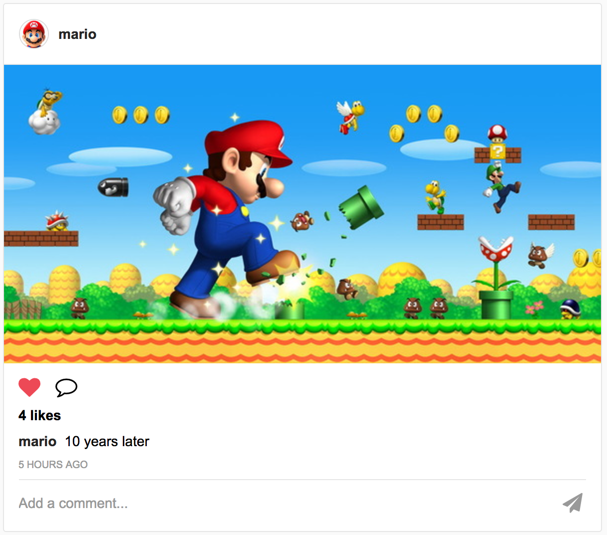
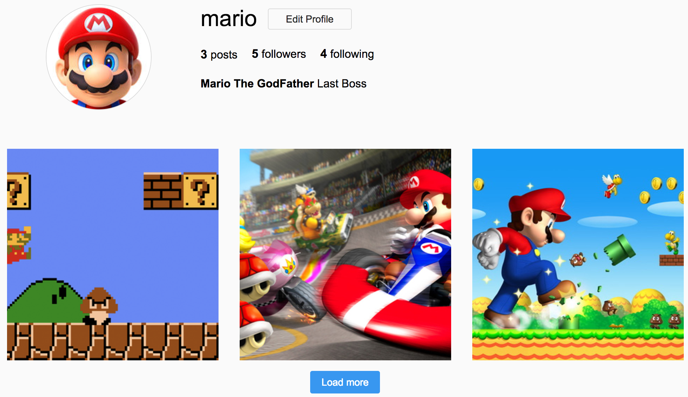

# Instagames

[Instagames.ninja][live]

[live]: http://instagames.ninja/

Instagames is a web application inspired by Instagram designed for gamers.
Users can see other people photos and share their own photos.
It is a full-stack project which is built using Ruby on Rails, PostgreSQL, and React/Redux.

## Features

### See and Share Photos

Homepage will feed photos that you or other accounts you are following posted.

Photos are loaded infinitely whenever your scroll through them all and reach at page bottom.

You can also check out photos of other accounts before following them (infinitely loading too).

### Like and Comments on Photos

You can always like and comment somebody photos or your own photos.

This features is immediately response (without loading page again) for a best user experience.

## Technologies

### Backend

[Ruby on Rails][rails] - a web application framework - is built at backend to provide RESTful API endpoints and progress data.

[PostgreSQL][pgsql] database system is used to store and retrieve data.

- Use BCrypt library to encrypt password for best security.
- Prevent CSRF (Cross-site request forgery) attack by one-time token.
- Paperclip and Amazon Web Service S3 store photos, files on cloud server to speed up page loading time.
- Figaro for secure configuration of API keys
- FriendlyId libary makes friendly URL for SEO (Search Engine Optimization)
- Jbuilder to response JSON data for RESTful request.
- Assets pipeline to pack resources will reduce request times.
- Hosted on Heroku platform to keep app awake for faster client response.

### Frontend

[React][react]/[Redux][redux] are JavaScript libraries built at frontend to make a single-page App with reuseable, modular code. They provide unidirectional dataflow, manage the application state for best user experience.

- Install and manage dependencies packages by NPM (Node Package Manager) .
- Webpack module bundler is used to bundle all files.
- Babel compile JS files for compatible code.
- SCSS / CSS3 create a simple but great design.

[rails]: http://rubyonrails.org/
[pgsql]: https://www.postgresql.org/
[react]: https://facebook.github.io/react/
[redux]: http://redux.js.org/

## Additional Resources

* [View Wireframes][wireframes]
* [React Components][components]
* [API endpoints][api-endpoints]
* [Database schema][schema]
* [Sample State][sample-state]

[wireframes]: docs/wireframes
[components]: docs/component-hierarchy.md
[sample-state]: docs/sample-state.md
[api-endpoints]: docs/api-endpoints.md
[schema]: docs/schema.md

## Future Improvements

Instagames project was built and designed in two weeks. There are still a few more features that can be implemented in future.

### Hashtags

Users can tag photos with #hashtag for search and share easier.

### Notifications

Users will be received notifications when people like, comment their photos or follow them.

### Direct messaging

Send messages to other users is a cool feature and the app will have a better community.
